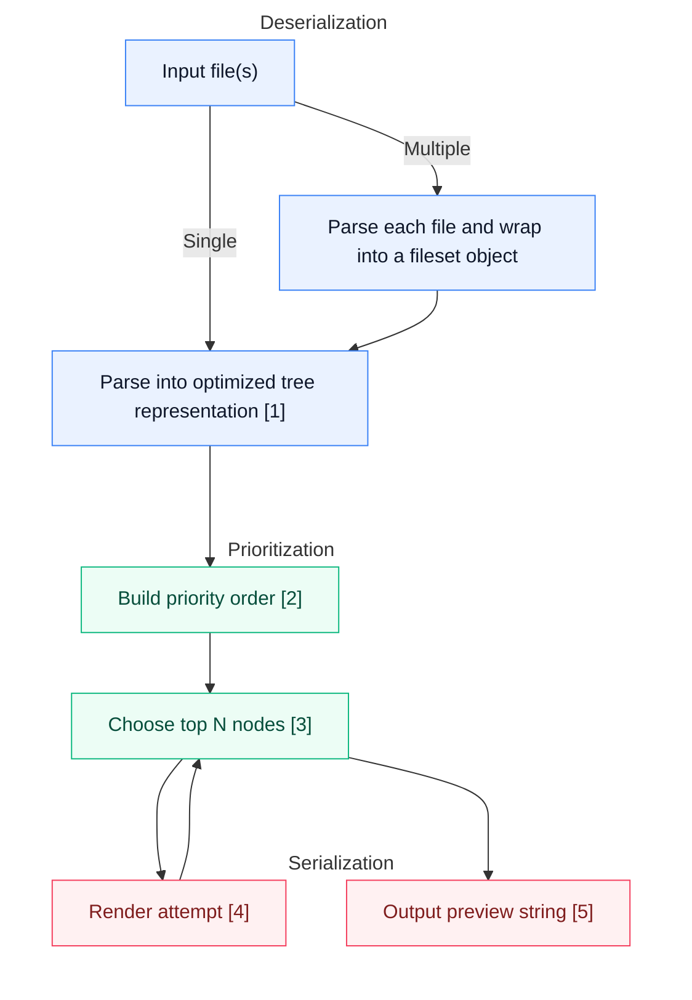

# headson

Head/tail for JSON — but structure‑aware. Get a compact preview that shows both the shape and representative values of your data, all within a strict character budget.

Available as:
- CLI (see [Usage](#usage))
- Python library (see [Python Bindings](#python-bindings))

## Install

Using Cargo:

    cargo install headson

From source:

    cargo build --release
    target/release/headson --help


## Features

- *Budgeted output*: specify exactly how much JSON you want to see
- *Multiple output formats* : `json` (machine‑readable), `pseudo` (human‑friendly), `js` (valid JavaScript, most detailed metadata).
- *Multiple inputs*: preview many files at once with a shared or per‑file budget.
- *Fast*: can process gigabyte-scale files in seconds (mostly disk-constrained)
- *Available as a CLI app and as a Python library*

## Fits into command line workflows

If you’re comfortable with tools like `head` and `tail`, use `headson` when you want a quick, structured peek into a JSON file without dumping the entire thing.

- `head`/`tail` operate on bytes/lines - their output is not optimized for tree structures
- `jq` you need to craft filters to preview large JSON files
- `headson` is like head/tail for trees: zero config but it keeps structure and represents content as much as possible 

## Usage

    headson [FLAGS] [INPUT...]

- INPUT (optional, repeatable): file path(s). If omitted, reads JSON from stdin. Multiple input files are supported.
- Prints the preview to stdout. On parse errors, exits non‑zero and prints an error to stderr.

Common flags:

- `-n, --budget <BYTES>`: per‑file output budget. When multiple input files are provided, the total budget equals `<BYTES> * number_of_inputs`.
- `-N, --global-budget <BYTES>`: total output budget across all inputs. Useful when you want a fixed-size preview across many files (may omit entire files). Mutually exclusive with `--budget`.
- `-f, --template <json|pseudo|js>`: output style (default: `pseudo`)
- `-m, --compact`: no indentation, no spaces, no newlines
- `--no-newline`: single line output
- `--no-space`: no space after `:` in objects
- `--indent <STR>`: indentation unit (default: two spaces)
- `--string-cap <N>`: max graphemes to consider per string (default: 500)
- `--tail`: prefer the end of arrays when truncating. Strings are unaffected. In `pseudo`/`js` templates the omission marker appears at the start; `json` remains strict JSON with no annotations.

Notes:

- With multiple input files:
  - JSON template outputs a single JSON object keyed by the input file paths.
  - Pseudo and JS templates render file sections with human-readable headers when newlines are enabled.
    - If you use `--compact` or `--no-newline` (both disable newlines), fileset output falls back to standard inline rendering (no per-file headers) to remain compact.
  - Using `--global-budget` may truncate or omit entire files to respect the total budget.
  - The tool finds the largest preview that fits the budget; if even the tiniest preview exceeds it, you still get a minimal, valid preview.
  - When passing file paths, directories and binary files are ignored; a notice is printed to stderr for each (e.g., `Ignored binary file: ./path/to/file`). Stdin mode reads the stream as-is.

Quick one‑liners:

- Peek a big JSON stream (keeps structure):

      zstdcat huge.json.zst | headson -n 800 -f pseudo

- Many files with a fixed overall size:

      headson -N 1200 -f json logs/*.json

- Glance at a file, JavaScript‑style comments for omissions:

      headson -n 400 -f js data.json

Show help:

    headson --help

## Examples: head vs headson

Input:

```json
{"users":[{"id":1,"name":"Ana","roles":["admin","dev"]},{"id":2,"name":"Bo"}],"meta":{"count":2,"source":"db"}}
```

Naive cut (can break mid‑token):

```bash
jq -c . users.json | head -c 80
# {"users":[{"id":1,"name":"Ana","roles":["admin","dev"]},{"id":2,"name":"Bo"}],"me
```

Structured preview with headson (pseudo):

```bash
headson -n 120 -f pseudo users.json
# {
#   users: [
#     { id: 1, name: "Ana", roles: [ "admin", … ] },
#     …
#   ]
#   meta: { count: 2, … }
# }
```

Machine‑readable preview (json):

```bash
headson -n 120 -f json users.json
# {"users":[{"id":1,"name":"Ana","roles":["admin"]}],"meta":{"count":2}}
```

## Python Bindings

A thin Python extension module is available on PyPI as `headson`.

 - Install: `pip install headson` (ABI3 wheels for Python 3.10+ on Linux/macOS/Windows).
- API:
  - `headson.summarize(text: str, *, template: str = "pseudo", character_budget: int | None = None, tail: bool = False) -> str`
    - `template`: one of `"json" | "pseudo" | "js"`
    - `character_budget`: maximum output size in characters (default: 500)
  - `tail`: prefer the end of arrays when truncating; strings unaffected. Affects only display templates (`pseudo`/`js`); `json` remains strict.

Example:

```python
import json
import headson

data = {"foo": [1, 2, 3], "bar": {"x": "y"}}
preview = headson.summarize(json.dumps(data), template="json", character_budget=200)
print(preview)

# Prefer the tail of arrays (annotations show in pseudo/js only)
print(
    headson.summarize(
        json.dumps(list(range(100))),
        template="pseudo",
        character_budget=80,
        tail=True,
    )
)
```

# Algorithm



Footnotes
- [1] Optimized tree representation: An arena-style tree stored in flat, contiguous buffers. Each node records its type and value plus index ranges into separate child and key arrays. Arrays are parsed with a cap on kept elements, and total sizes are tracked so omission information can be emitted later. This layout is cache-friendly and avoids pointer chasing.
- [2] Priority order: Nodes are scored so previews surface representative structure and values first. Earlier array items are preferred (or the tail, when configured), object properties have a consistent ordering, and strings expand by grapheme with early characters prioritized over very deep expansions.
- [3] Choose top N nodes (binary search): Iteratively picks N so that the rendered preview fits within the character budget, looping between “choose N” and a render attempt to converge quickly.
- [4] Render attempt: Serializes the currently included nodes using the selected template (json, pseudo, or js). Adds omission summaries when parts are elided; for multiple inputs, human-friendly templates can show per-file sections.
- [5] Output preview string: The final compact preview that satisfies the configured budget.

## License

MIT
